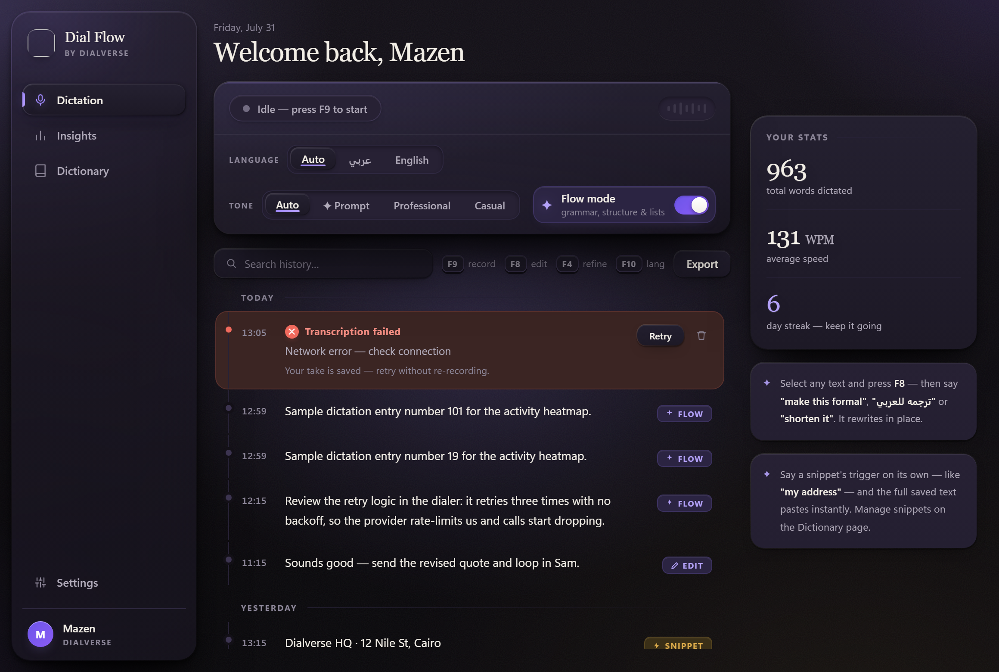
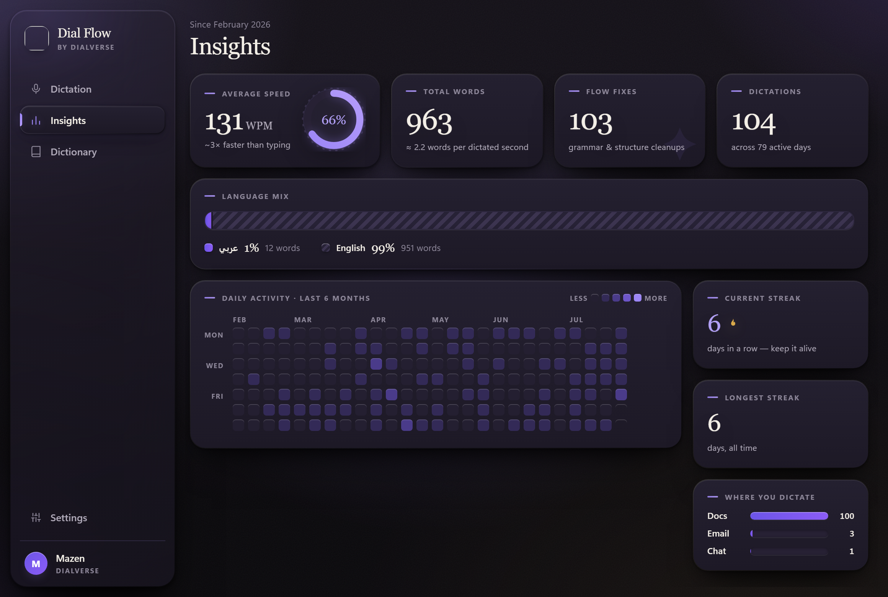
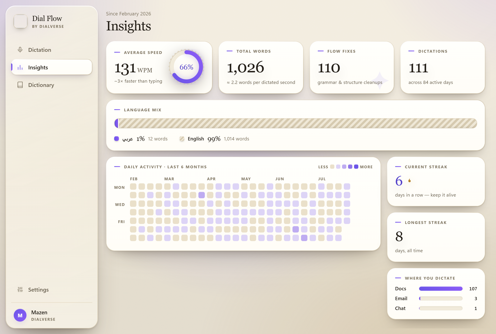
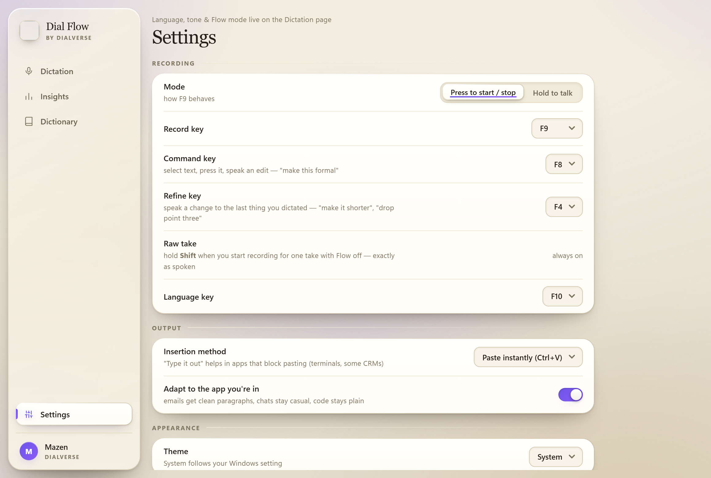

<p align="center">
  
</p>

<h1 align="center">Dial Flow</h1>

<p align="center">
  <b>Speak Arabic. Speak English. Speak both in the same sentence.</b><br>
  Press <kbd>F9</kbd> anywhere on Windows — your words appear right where your cursor is.
</p>

<p align="center">
  <a href="../../releases/latest"></a>
  
  
  
</p>

<p align="center">
  
</p>

<p align="center">
  
  
</p>

---

## Why we built this

Dictation tools are magical — until you speak **Egyptian Arabic mixed with English**
mid-sentence, the way our whole team actually talks. Then they fall apart.

Dial Flow is built on Cohere's open Arabic speech model — the top open-source model
on the Arabic ASR leaderboard — purpose-trained for **dialects** (Egyptian, Gulf,
Levantine, Najdi, Hijazi, North African) and **Arabic–English code-switching**.
We wrapped it in a desktop experience we love, and it costs the team **nothing to run**.

## ✦ What it does

| | |
|---|---|
| **Dictate anywhere** | <kbd>F9</kbd> in WhatsApp, Outlook, Word, your CRM — anywhere you can type. Press-to-talk or hold-to-talk. |
| **Flow mode** | AI fixes grammar, restructures rambling sentences, breaks paragraphs, and turns spoken enumerations into lists — «يعني... امم» goes in, organized text comes out. Toggle it off for word-for-word. |
| **App-aware** | Knows where you're dictating: emails get clean paragraphs, chats stay casual, code stays plain text. |
| **Command mode** | Select any text, press <kbd>F8</kbd>, and say the edit — *"make this formal"*, *"ترجمه للعربي"*, *"shorten it"*. It rewrites in place. |
| **Tone presets** | Auto, ✦ Prompt, Professional or Casual — one click on the dictation page. Prompt mode reorganizes a rambling dictation into a clean brief for an AI, in your own words. |
| **Refine** | <kbd>F4</kbd> and speak a change to the last thing you dictated — *"make it shorter"*, *"drop point three"*. No selecting required. |
| **Raw take** | Hold <kbd>Shift</kbd> as you start recording for one take with Flow off — exactly as spoken. |
| **Prompt framings** | Put `{}` in a snippet and it becomes a reusable template: say *"review framing &lt;what you want&gt;"* and your words drop into the slot. |
| **Auto language** | Speak Arabic, English or both — no toggle needed (F10 still switches if you want to pin one). |
| **Dictionary** | Teach it your client names and company jargon once — spelled right forever, in both languages. |
| **Insights** | Words dictated, speed in WPM, language mix, and a 6-month streak heatmap. |
| **The floating bar** | Drag it to the left, bottom or right edge — it stands upright on the sides and follows you across monitors. Hover for a cancel button, or open it into a panel. Failures show up right there. |
| **Lives in the tray** | Close the window, hotkeys stay live. Optional *Start with Windows*. |
| **Light & dark** | A clean modern UI that follows your Windows theme — or pin it either way. |
| **Private by design** | History and audio stay on your machine. Each person uses their own free API key. |

<p align="center">
  
</p>

<p align="center">
  
  
</p>

## Get started — 3 minutes / التثبيت

1. **[⬇ Download DialFlow.exe](../../releases/latest)** and run it.
   Windows may show *"Windows protected your PC"* the first time — click
   **More info → Run anyway** (normal for unsigned internal tools).
   <br>أول مرة ويندوز ممكن يحذرك — دوس **More info** بعدين **Run anyway**. ده طبيعي.
2. **Wait for the speech model on first launch.** Dial Flow transcribes on
   your own machine, so the first run downloads a **~1.5 GB** model once.
   The floating bar shows the progress; after that it never touches the
   internet to transcribe.
   <br>أول تشغيل هينزّل موديل حجمه ١.٥ جيجا مرة واحدة بس — بعد كده كله بيشتغل على جهازك.
3. Press <kbd>F9</kbd> in any app and start talking. <kbd>F10</kbd> switches
   Arabic ⇄ English.
   <br>دوس **F9** واتكلم عربي أو انجليزي أو الاتنين مع بعض — الكلام هيتكتب لوحده.

> **No API key needed.** Speech recognition runs locally. An NVIDIA GPU makes
> it roughly 13× faster (a 4-minute take transcribes in seconds); without one
> it falls back to the CPU and still works, just slower. Settings → System
> shows which one you're on.
>
> **Flow mode** — the AI cleanup that turns rambling speech into organised
> text — is the one feature that still calls out. Paste a free Cohere key in
> Settings to enable it, or leave it off and get raw transcripts.

## Build from source

```bash
git clone https://github.com/Dialverse-ai/dial-flow
cd dial-flow
pip install -r requirements.txt
python dial_app.py
```

Package a single-file exe:

```bash
pyinstaller --noconfirm --onefile --windowed --name DialFlow --icon app.ico ^
  --add-data "app.ico;." --add-data "web;web" ^
  --collect-all webview --collect-all clr_loader --collect-all pythonnet dial_app.py
```

**Stack:** Python engine (recording, hotkeys, tray) + WebView2 frontend
(`web/index.html`, 60fps, zero external assets) · speech by
[`cohere-transcribe-arabic`](https://huggingface.co/CohereLabs/cohere-transcribe-arabic-07-2026)
· cleanup by Cohere Command · design via Claude Design.

---

<p align="center">
  Built in one day with Claude Code · <b>Dialverse</b> · 2026<br>
  <sub>يلا — go dictate something.</sub>
</p>
