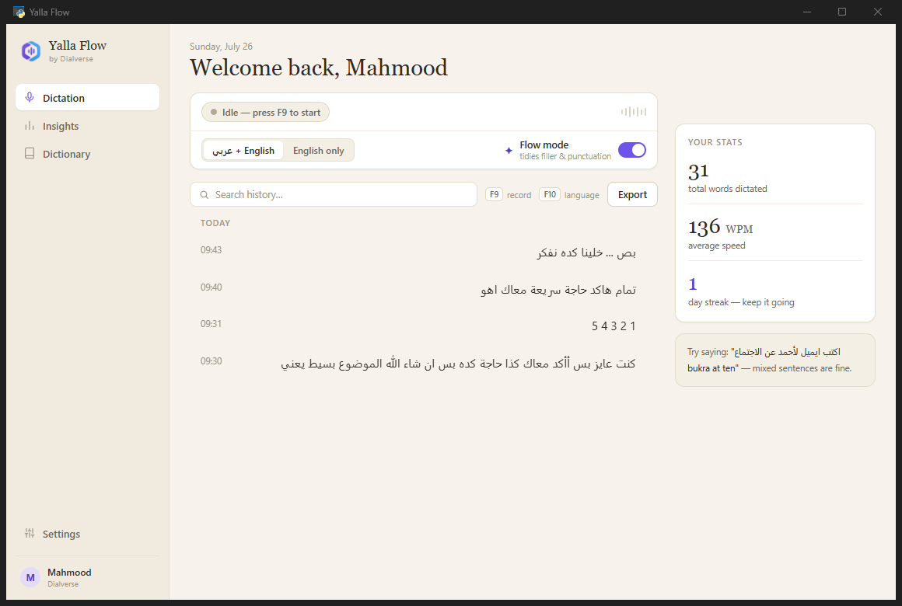
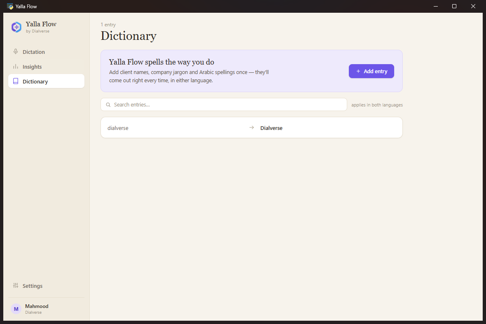

<p align="center">
  
</p>

<h1 align="center">Yalla Flow</h1>

<p align="center">
  <b>Speak Arabic. Speak English. Speak both in the same sentence.</b><br>
  Press <kbd>F9</kbd> anywhere on Windows — your words appear right where your cursor is.
</p>

<p align="center">
  <a href="../../releases/latest"></a>
  
  
  
</p>

<p align="center">
  
</p>

---

## Why we built this

Dictation tools are magical — until you speak **Egyptian Arabic mixed with English**
mid-sentence, the way our whole team actually talks. Then they fall apart.

Yalla Flow is built on Cohere's open Arabic speech model — the top open-source model
on the Arabic ASR leaderboard — purpose-trained for **dialects** (Egyptian, Gulf,
Levantine, Najdi, Hijazi, North African) and **Arabic–English code-switching**.
We wrapped it in a desktop experience we love, and it costs the team **nothing to run**.

## ✦ What it does

| | |
|---|---|
| **Dictate anywhere** | <kbd>F9</kbd> in WhatsApp, Outlook, Word, your CRM — anywhere you can type. Press-to-talk or hold-to-talk. |
| **Flow mode** | AI tidies your filler words, stutters and punctuation — «يعني... امم» goes in, clean text comes out. Toggle it off for word-for-word. |
| **Dictionary** | Teach it your client names and company jargon once — spelled right forever, in both languages. |
| **Insights** | Words dictated, speed in WPM, language mix, and a 6-month streak heatmap. |
| **The pill** | A little floating bar follows your cursor across monitors — pulsing while you talk, spinning while it transcribes. |
| **Lives in the tray** | Close the window, hotkeys stay live. Optional *Start with Windows*. |
| **Private by design** | History and audio stay on your machine. Each person uses their own free API key. |

<p align="center">
  
</p>

## Get started — 3 minutes / التثبيت

1. **[⬇ Download YallaFlow.exe](../../releases/latest)** and run it.
   Windows may show *"Windows protected your PC"* the first time — click
   **More info → Run anyway** (normal for unsigned internal tools).
   <br>أول مرة ويندوز ممكن يحذرك — دوس **More info** بعدين **Run anyway**. ده طبيعي.
2. Grab a **free key** at [dashboard.cohere.com](https://dashboard.cohere.com/api-keys)
   (sign up → copy the Trial key) and paste it into the welcome screen.
   <br>اعمل حساب مجاني وانسخ الـ Trial key والصقه في شاشة الترحيب.
3. Press <kbd>F9</kbd> in any app and start talking. <kbd>F10</kbd> switches
   Arabic ⇄ English.
   <br>دوس **F9** واتكلم عربي أو انجليزي أو الاتنين مع بعض — الكلام هيتكتب لوحده.

## Build from source

```bash
git clone https://github.com/Dialverse/yalla-flow
cd yalla-flow
pip install -r requirements.txt
python yalla_app.py
```

Package a single-file exe:

```bash
pyinstaller --noconfirm --onefile --windowed --name YallaFlow --icon app.ico ^
  --add-data "app.ico;." --add-data "web;web" ^
  --collect-all webview --collect-all clr_loader --collect-all pythonnet yalla_app.py
```

**Stack:** Python engine (recording, hotkeys, tray) + WebView2 frontend
(`web/index.html`, 60fps, zero external assets) · speech by
[`cohere-transcribe-arabic`](https://huggingface.co/CohereLabs/cohere-transcribe-arabic-07-2026)
· cleanup by Cohere Command · design via Claude Design.

---

<p align="center">
  Built in one day with Claude Code · <b>Dialverse</b> · 2026<br>
  <sub>يلا — go dictate something.</sub>
</p>
